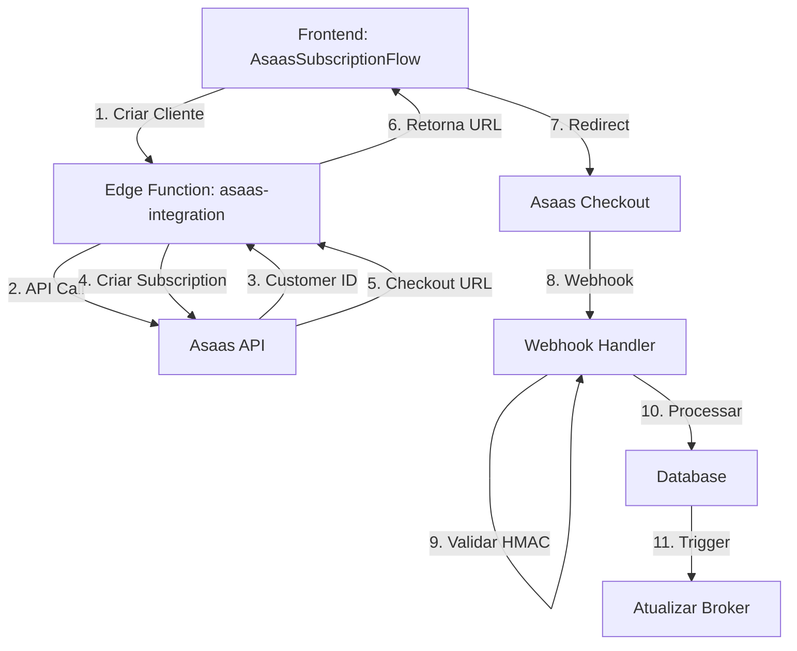

# 🚀 Guia de Integração Asaas - ConectaIOS

## 📋 Índice
1. [Visão Geral](#visão-geral)
2. [Arquitetura](#arquitetura)
3. [Configuração](#configuração)
4. [Fluxo de Assinatura](#fluxo-de-assinatura)
5. [Webhooks](#webhooks)
6. [Testing](#testing)
7. [Monitoring](#monitoring)
8. [Troubleshooting](#troubleshooting)

---

## 🎯 Visão Geral

Integração completa com Asaas para gerenciar assinaturas de planos no ConectaIOS.

### ✅ O que está implementado:
- ✅ **Fase 1**: Database (subscriptions, asaas_customers, asaas_webhooks)
- ✅ **Fase 2**: Edge Function Security (HMAC validation, rate limiting)
- ✅ **Fase 3**: Frontend Components (AsaasSubscriptionFlow)
- ✅ **Fase 4**: Webhook Handler (subscriptions + deals)
- ✅ **Fase 5**: Testing & Monitoring (AsaasWebhookMonitor)

---

## 🏗️ Arquitetura



---

## ⚙️ Configuração

### 1. Variáveis de Ambiente (Supabase Secrets)

```bash
# OBRIGATÓRIO
ASAAS_API_KEY=your_asaas_api_key

# OPCIONAL (defaults)
ASAAS_ENV=SANDBOX              # ou PRODUCTION
ASAAS_WEBHOOK_SECRET=your_secret  # Para validação HMAC
```

### 2. Configurar Webhook no Asaas

1. Acesse: https://sandbox.asaas.com/config/webhooks (ou production)
2. Adicione URL: `https://paawojkqrggnuvpnnwrc.supabase.co/functions/v1/asaas-integration`
3. Selecione eventos:
   - ✅ `PAYMENT_CONFIRMED`
   - ✅ `PAYMENT_RECEIVED`
   - ✅ `PAYMENT_OVERDUE`
   - ✅ `PAYMENT_DELETED`
4. Configure Secret (ASAAS_WEBHOOK_SECRET) para validação HMAC

---

## 🔄 Fluxo de Assinatura

### Passo 1: Usuário Escolhe Plano
```typescript
// src/components/AsaasSubscriptionFlow.tsx
// Mostra 3 planos: Básico (R$ 97), Pro (R$ 197), Enterprise (R$ 397)
```

### Passo 2: Preenche Dados
```typescript
// Valida:
- Nome completo
- Email válido
- Telefone (10+ dígitos)
- CPF/CNPJ (11+ dígitos)
```

### Passo 3: Backend Processa

**3.1 - Criar Cliente**
```typescript
POST /asaas-integration
{
  "action": "create_customer",
  "data": {
    "name": "João Silva",
    "email": "joao@email.com",
    "phone": "11999999999",
    "cpfCnpj": "12345678900"
  }
}
```

**3.2 - Criar Assinatura**
```typescript
POST /asaas-integration
{
  "action": "create_subscription",
  "data": {
    "customer": "cus_xxxxx",
    "billingType": "UNDEFINED",  // Deixa cliente escolher no checkout
    "value": 197,
    "nextDueDate": "2025-10-15",
    "cycle": "MONTHLY",
    "description": "ConectaIOS - Plano Pro",
    "externalReference": "plan_pro_<user_id>_<timestamp>"
  }
}
```

**3.3 - Retorna Checkout URL**
```typescript
// Response
{
  "success": true,
  "subscription": { ... },
  "checkoutUrl": "https://sandbox.asaas.com/i/<codigo>"
}
```

### Passo 4: Usuário Paga no Asaas

Cliente é redirecionado para o checkout do Asaas e escolhe:
- 💳 PIX
- 💳 Cartão de Crédito
- 💳 Boleto

---

## 🔔 Webhooks

### Eventos Processados

| Evento | Descrição | Ação |
|--------|-----------|------|
| `PAYMENT_CONFIRMED` | Pagamento confirmado | `subscription.status = 'active'` |
| `PAYMENT_RECEIVED` | Pagamento recebido | `subscription.status = 'active'` |
| `PAYMENT_OVERDUE` | Pagamento vencido | `subscription.status = 'past_due'` |
| `PAYMENT_DELETED` | Assinatura cancelada | `subscription.status = 'canceled'` |

### Estrutura do Webhook

```json
{
  "event": "PAYMENT_CONFIRMED",
  "payment": {
    "id": "pay_xxxxx",
    "customer": "cus_xxxxx",
    "subscription": "sub_xxxxx",
    "value": 197,
    "status": "CONFIRMED",
    "externalReference": "plan_pro_<user_id>_<timestamp>"
  }
}
```

### Processamento

```typescript
// 1. Validar HMAC Signature
const signature = req.headers.get('asaas-signature');
const isValid = await verifyWebhookSignature(body, signature);

// 2. Registrar no banco
INSERT INTO asaas_webhooks (event, payment, received_at, processed)

// 3. Extrair user_id do externalReference
const userId = externalReference.split('_')[2];

// 4. Atualizar subscription
UPSERT subscriptions (profile_id, status, next_billing_date)

// 5. Trigger atualiza broker automaticamente
// sync_broker_subscription() → UPDATE brokers SET subscription_status
```

---

## 🧪 Testing

### 1. Testar Criação de Assinatura

1. Acesse: `/app/perfil` → Aba "Plano"
2. Escolha um plano
3. Preencha dados válidos
4. Clique "Assinar Agora"
5. Verifique console logs:
   ```
   🔄 Criando cliente no Asaas...
   ✅ Cliente criado: cus_xxxxx
   🔄 Criando assinatura...
   ✅ Assinatura criada: sub_xxxxx
   ```

### 2. Testar Webhook (Sandbox)

**Método 1: Via Asaas Dashboard**
1. Acesse: https://sandbox.asaas.com/payments
2. Encontre o pagamento da subscription
3. Clique em "..." → "Marcar como Confirmado"
4. Webhook é disparado automaticamente

**Método 2: Via cURL (simulação)**
```bash
curl -X POST https://paawojkqrggnuvpnnwrc.supabase.co/functions/v1/asaas-integration \
  -H "Content-Type: application/json" \
  -H "asaas-signature: <HMAC_SHA256>" \
  -d '{
    "event": "PAYMENT_CONFIRMED",
    "payment": {
      "id": "pay_test_123",
      "customer": "cus_test_456",
      "value": 197,
      "status": "CONFIRMED",
      "externalReference": "plan_pro_<user_id>_1234567890"
    }
  }'
```

### 3. Verificar no Banco

```sql
-- Ver webhooks recebidos
SELECT * FROM asaas_webhooks 
ORDER BY created_at DESC 
LIMIT 10;

-- Ver subscriptions
SELECT * FROM subscriptions 
WHERE profile_id = '<user_id>';

-- Ver broker atualizado
SELECT subscription_status, subscription_expires_at 
FROM brokers 
WHERE user_id = '<user_id>';
```

---

## 📊 Monitoring

### 1. Webhook Monitor (Admin)

Acesse: `/app/admin` → Aba "Webhooks"

Visualize:
- ✅ Total de webhooks recebidos
- ✅ Processados com sucesso
- ❌ Erros
- ⏳ Pendentes

### 2. Edge Function Logs

```bash
# Ver logs em tempo real
supabase functions logs asaas-integration --project-ref paawojkqrggnuvpnnwrc
```

Ou acesse: https://supabase.com/dashboard/project/paawojkqrggnuvpnnwrc/functions/asaas-integration/logs

### 3. Database Queries

```sql
-- Webhooks não processados
SELECT * FROM asaas_webhooks 
WHERE processed = false 
ORDER BY created_at DESC;

-- Subscriptions ativas
SELECT COUNT(*) FROM subscriptions 
WHERE status = 'active';

-- Subscriptions vencidas
SELECT * FROM subscriptions 
WHERE status = 'past_due';
```

---

## 🔧 Troubleshooting

### Problema 1: "Customer ID not returned"

**Causa**: CPF/CNPJ inválido ou já existente
**Solução**: 
- Validar formato do CPF/CNPJ
- Verificar se cliente já existe no Asaas
- Usar CPF de teste: `11144477735`

### Problema 2: "Invalid webhook signature"

**Causa**: ASAAS_WEBHOOK_SECRET não configurado ou incorreto
**Solução**:
```bash
# Configurar secret no Supabase
supabase secrets set ASAAS_WEBHOOK_SECRET=your_secret
```

### Problema 3: Webhook processado mas subscription não atualizou

**Causa**: externalReference não está no formato correto
**Solução**:
- Formato obrigatório: `plan_<planId>_<userId>_<timestamp>`
- Exemplo: `plan_pro_123e4567-e89b-12d3-a456-426614174000_1696886400000`

### Problema 4: "Rate limit exceeded"

**Causa**: Mais de 100 requests/minuto do mesmo IP
**Solução**:
- Aguardar 1 minuto
- Usar IPs diferentes para testes
- Aumentar limite no edge function (se necessário)

---

## 📚 Recursos Adicionais

- [Documentação Asaas](https://docs.asaas.com/)
- [API Reference](https://docs.asaas.com/reference)
- [Webhooks Guide](https://docs.asaas.com/docs/webhooks)
- [Sandbox Environment](https://sandbox.asaas.com/)

---

## 🎉 Próximos Passos

- [ ] Implementar retry automático para webhooks falhados
- [ ] Adicionar notificações por email de status de assinatura
- [ ] Dashboard de métricas de assinaturas
- [ ] Suporte a cupons de desconto
- [ ] Suporte a múltiplos planos por usuário

---

**Última atualização**: 2025-10-08
**Versão**: 1.0.0
**Autor**: Lovable AI
